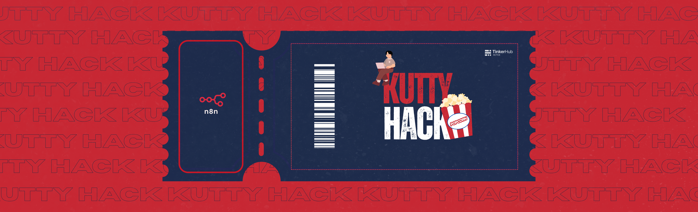

# 🚀 KuttyHack Series: The n8n Edition

# Title: job finder

---

### Team Members
* **Member 1:** Varun S Kumar

---

### Link to product walkthrough
[Insert Link to Video (YouTube/Drive)]

---

### How it Works?

#### 1. Explaining the working of project
2. How It Works (Workflow Overview)

User Profile Input – The user provides their education, skills, location, and career preferences.

Opportunities Data – A Google Sheet contains available jobs, internships, or skill programs.

Automation Engine (n8n) – The workflow runs daily (or manually) and performs the following:

Aggregates user profile and opportunities

Sends the combined data to an AI (ChatGPT) for matching

Classifies opportunities as STRONG_MATCH or NO_STRONG_MATCH

Conditional Logic (IF Node) – Checks whether there are strong matches.

Email Notification – Sends a digest email to the user:

Lists top 3 matching opportunities with one-line reasoning

If none match, sends a message: “No strong matches today.”

#### 2. Embed video of project demo
[Insert link to Video (Youtube/Drive)]

---

### Libraries
[Mention the Libraries/Tools Used.]

---

### How to configure
[Explain How to configue.]

---

### How to run
[Explain How to run.]

---

### Running the App
[Running the App on differnet devices.]
